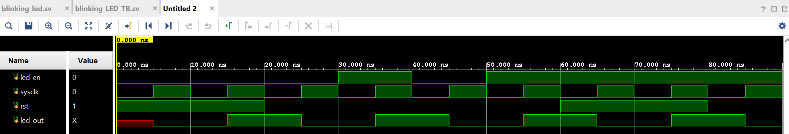

# BlinkingLED
This project is desiged to use one onboard LED and one onboard LED light. Implementing a counter, we are designing the led to blink every one second when SW0 is pushed to ON.

# Software
Vivado 2023.1

# Hardware
ZYNQ - Zybo-Z7 (7010 Development Board)

# Timing Simulation
Below is the behavioral simulation verifying proper operation of this design:

In this time wave simulation, we can see that the clock toggles every 5ns. At the beginning, the LED output is unknown until the first rising edge of the clock occurs. This is when the reset is active and sets the LED output LOW. When reset is not active, the counter begins to count. Once the counter reaches its limit, the LED output toggles between LOW and HIGH, and the counter resets to begin counting over gain. If reset is activated or the LED input is disabled, the counter will also reset its count to start over and the LED output will remain LOW.
